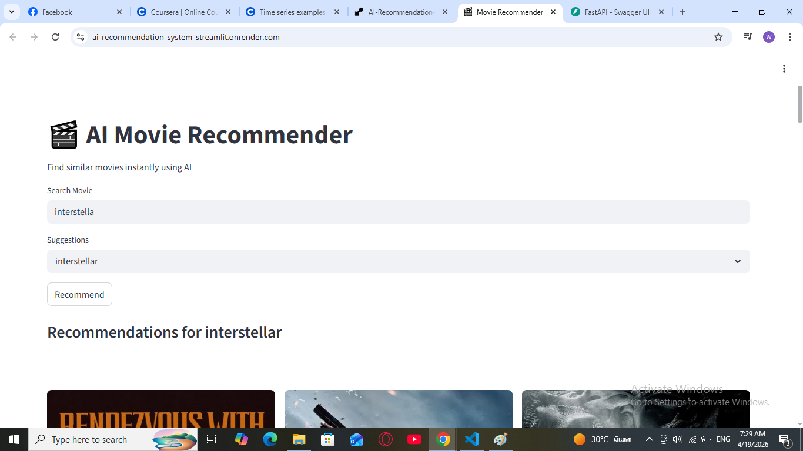
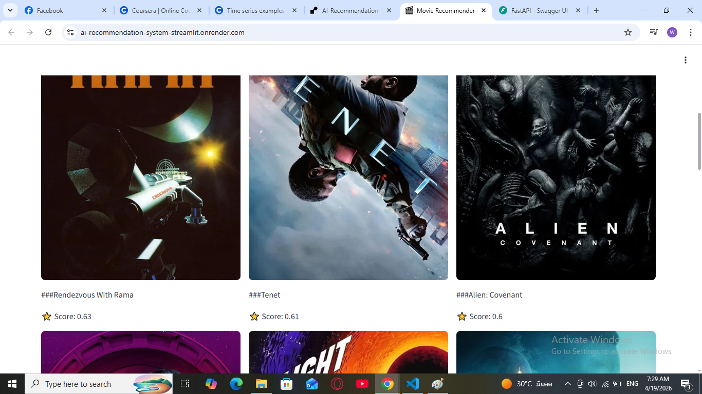
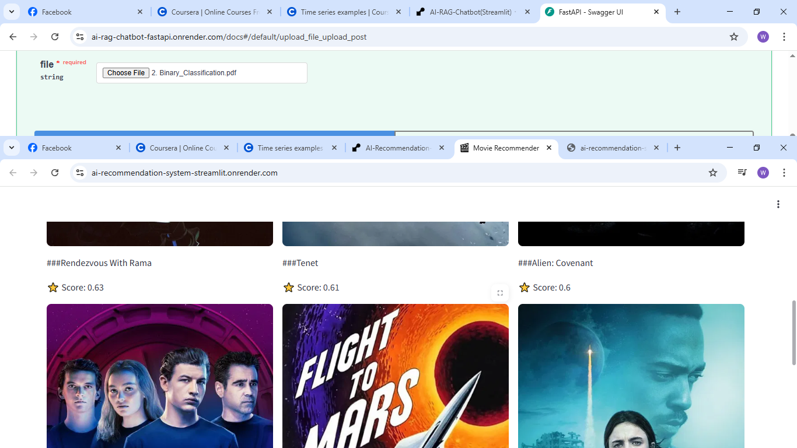
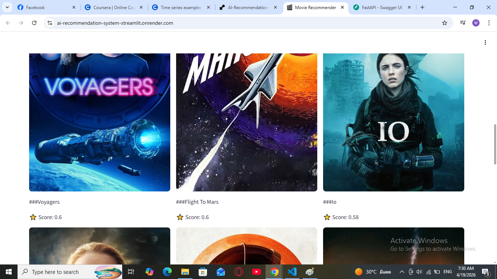
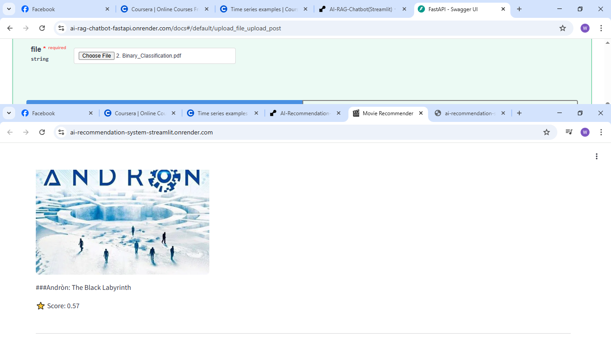
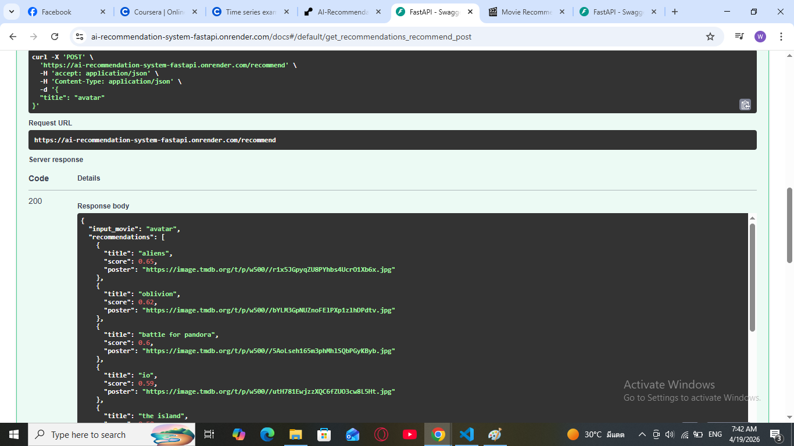

# 🎬 AI Movie Recommendation System

An intelligent movie recommendation system built using **Machine Learning + FastAPI + Streamlit**.
This project suggests similar movies based on semantic similarity using **AI embeddings**.

---

## 🚀 Live Demo

- 🌐 Streamlit App: (https://ai-recommendation-system-streamlit.onrender.com)
- ⚡ FastAPI Backend: (https://ai-recommendation-system-fastapi.onrender.com)

## ⚠️ **Important:** Please run the FastAPI backend first before using the Streamlit app.  
## Otherwise, the app will not return any responses.

---

## 🚀 Features

* 🔍 Smart movie search with auto-suggestions
* 🤖 AI-based recommendations using sentence embeddings
* 🎯 Fuzzy search (handles typos like *"interstella" → "interstellar"*)
* 🖼️ Movie posters fetched from TMDB API
* ⭐ Similarity score for each recommendation
* 🎬 Clean UI with Streamlit (grid layout)
* ⚡ FastAPI backend for high performance

---

## 🧠 How It Works

1. Movie data is loaded from a dataset (`dataset.csv`)
2. Text features are combined:

   * Synopsis
   * Genre
   * Director
   * Content
3. AI embeddings are generated using:

   * `sentence-transformers (all-MiniLM-L6-v2)`
4. Cosine similarity is used to find similar movies
5. Results are filtered (genre + quality filters)
6. Posters are fetched from TMDB API

---

## 🏗️ Tech Stack

* **Python**
* **FastAPI** (Backend API)
* **Streamlit** (Frontend UI)
* **Scikit-learn** (Cosine similarity)
* **Sentence Transformers** (Embeddings)
* **RapidFuzz** (Fuzzy search)
* **TMDB API** (Movie posters)

---

## 📁 Project Structure

```
AI-Movie-Recommender/
│
├── api/
│   └── main.py              # FastAPI backend
│
├── model/
│   └── recommender.py      # Recommendation logic
│
├── data/
│   └── dataset.csv         # Movie dataset
│
├── dashboard/                  # Streamlit frontend
│    └──app.py
├── embeddings.npy          # Precomputed embeddings
└── README.md
```

---

## ⚙️ Installation

### 1. Clone Repository

```
git clone https://github.com/wpko/AI-Recommendation-System.git
cd AI-Recommendation-System
```

---

### 2. Create Virtual Environment

```
python -m venv venv
venv\Scripts\activate   # Windows
```

---

### 3. Install Dependencies

```
pip install -r requirements.txt
```

---

## 🔑 TMDB API Setup

1. Create account at: https://www.themoviedb.org/
2. Get your API key
3. Add it in `main.py`:

```python
API_KEY = "your_tmdb_api_key"
```

---

## ▶️ Run the Project

### Step 1: Start FastAPI Backend

```
python -m uvicorn api.main:app --reload
```

👉 API will run at:
http://127.0.0.1:8000

---

### Step 2: Start Streamlit Frontend

```
streamlit run app.py
```

👉 UI will open in browser automatically


---

## 🧪 Example Usage

* Input: `interstella`
* Output:

  * Interstellar-like movies
  * Posters + similarity scores

---

## 📸 Screenshots

### Streamlit Screenshots
<p align="center">
  
  
  
  
  
</p>

### FastAPI Screenshot
<p align="center">
  
</p>

---

## 🎯 Future Improvements

* 🔥 Personalized recommendations
* 🎞️ Trailer integration (YouTube API)

---

## 🤝 Contributing

Feel free to fork this repository and improve it!

---

## 👨‍💻 Author

**Wai Lay**
Aspiring AI / Python Developer 🚀

---

⭐ If you like this project, give it a star on GitHub!
